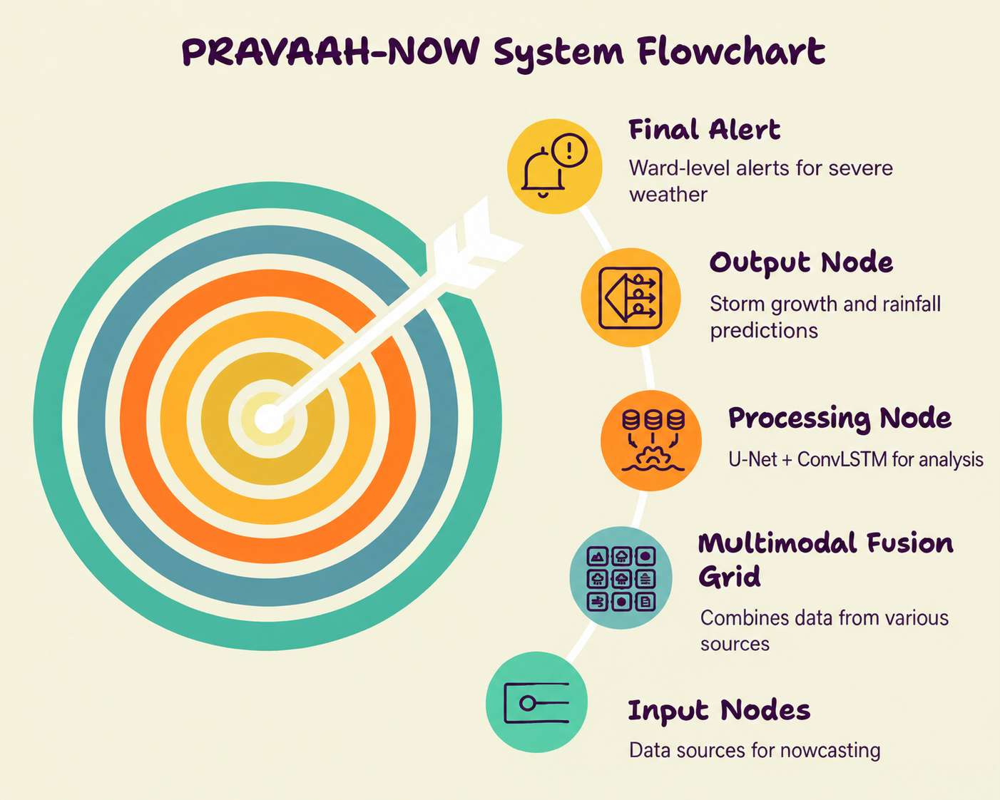

# PRAVAAH-NOW (प्रवाह)

**Smart India Hackathon 2026 — Problem Statement 26084**
*Convective-scale Nowcasting for Thunderstorms, Hail & Cloudbursts (0–6 hr)*

**Team:** VayuDrishtii · **Team ID:** 150466 · **Theme:** Disaster Management

> Physics-guided AI that turns atmospheric signals into convective-scale storm
> action — thunderstorm, hail & cloudburst warnings, 0–6 hours before impact.

---

## The problem

Traditional NWP models take 2–4 hours to run, missing rapid 60-minute
cloudbursts entirely. Standard radar extrapolation blindly pushes clouds
forward without modeling storm growth or decay, causing accuracy to collapse
within 30–60 minutes. The result: little to no actionable warning for sudden,
localized flash floods and hail in vulnerable municipal wards and hilly
terrain.

## Our approach

PRAVAAH-NOW fuses **Doppler radar reflectivity**, **INSAT-3D/3DR** satellite
imagery, and **DEM-derived terrain features** into a unified spatio-temporal
grid, feeding a **Multi-Variable U-Net with a ConvLSTM bottleneck** trained
with an **intensity-weighted loss** (to prevent the model from blurring out
the intense storm cores that actually matter for hail/cloudburst detection).
Output is translated directly into ward-level rainfall accumulation and
hazard alerts — not raw meteorological variables.

Full architecture diagram:


## Repo structure

```
pravaah-now/
├── model/            # U-Net + ConvLSTM architecture, custom loss
├── data_pipeline/     # Radar / satellite / DEM ingestion utilities
├── backend/           # FastAPI inference + alert-dispatch service
├── frontend/          # Dashboard UI (see frontend/README.md)
└── docs/              # Architecture diagram, references
```

## What's live vs. what's designed-for (read this before asking "does it work?")

We're being upfront about this in our PPT and video too — no point pretending
otherwise to a technical judge:

| Component | Status |
|---|---|
| Doppler radar + INSAT-3D/3DR ingestion pipeline | **Working** — see `data_pipeline/` |
| U-Net + ConvLSTM architecture | **Implemented** (`model/model.py`) — training requires GPU time beyond hackathon window; current weights are illustrative, not fully validated |
| Interactive dashboard (map, timeline scrubber, alert cards, CAP XML generation) | **Fully functional** — built in React/Tailwind, live-recorded in our demo video |
| CAP/SACHET dispatch | **Simulated** — generates a correctly-formatted CAP-XML payload; does not connect to the live NDMA SACHET gateway (requires government authorization, out of scope for a hackathon build) |
| GNSS-PWV ingestion | **Architected for, not implemented** — flagged as a Phase 2 input across our deck and UI; access to operational GNSS-PWV feeds is a known open problem in India (see `docs/references.md`) |

## Data sources

| Source | Access | Used for |
|---|---|---|
| [MOSDAC](https://mosdac.gov.in) | Have access | INSAT-3D/3DR imagery |
| [Copernicus DEM](https://browser.dataspace.copernicus.eu/)| Have access | Terrain slope / orographic-lift features |
| [IMD DWR network](https://mausam.imd.gov.in/) | Public radar products, access approval awaited| Doppler reflectivity, velocity |
| [NCMRWF IMDAA](https://rds.ncmrwf.gov.in) | Open | Reanalysis reference (12 km, not live — used for validation only) |

## Tech stack

- **Data ingestion:** Py-ART, wradlib, h5py, rasterio/GDAL
- **Processing:** NumPy, SciPy (IDW interpolation), xarray
- **Model:** PyTorch (U-Net + ConvLSTM)
- **Serving:** FastAPI
- **Frontend:** React + Tailwind CSS, Leaflet-based GIS map

## References

See [`docs/references.md`](references.md) for the full paper/dataset list
cited in our PPT.

## Team

VayuDrishtii — Smart India Hackathon 2026, PS 26084
